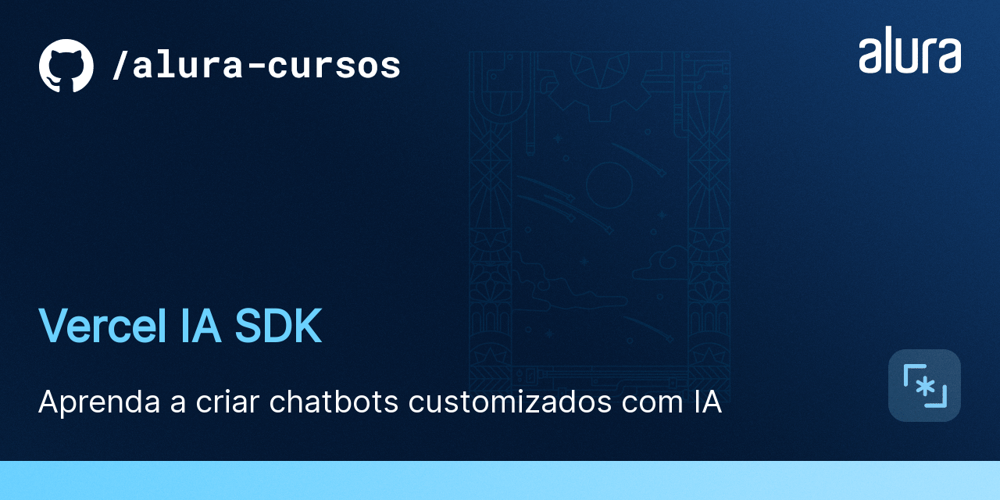

# Curso: Vercel IA SDK

Neste curso, você aprenderá a integrar o Vercel AI SDK em uma aplicação Next.js para construir um assistente inteligente que interage com usuários de forma dinâmica. O projeto do curso, chamado Vidy, será um assistente especializado em recomendações de filmes, demonstrando como utilizar IA e SSR (Server-Side Rendering) juntos.

## 🔨 Funcionalidades do projeto

Durante o curso, você implementará:

- Um assistente de IA capaz de responder perguntas sobre filmes.
- Implementação de respostas em tempo real utilizando streaming de respostas do modelo de IA.
- Integração com modelos de linguagem avançados (como GPT) para processar e responder perguntas.
- Rate limiting para controlar o fluxo de requisições ao assistente.

## ✔️ Técnicas e tecnologias utilizadas

Você irá trabalhar com as seguintes tecnologias e conceitos:

- **Next.js**: Framework React com funcionalidades de SSR e API Routes.
- **Vercel AI SDK**: SDK para construir e integrar assistentes de IA em aplicações web.
- **Redis e upstash**: Para gerenciamento de rate limiting e controle de acessos.
- **Logs e tratamento de erros**: Implementação de um sistema robusto de gerenciamento de logs e controle de erros.

## 🎯 O que você vai aprender

Ao longo do curso, você aprenderá a:

- Criar um assistente de IA utilizando o modelo GPT.
- Implementar rate limiting para proteger suas rotas e limitar o número de requisições.
- Configurar o SDK da Vercel AI para construir fluxos de comunicação entre o assistente e os usuários.
- Gerenciar logs e erros.

## 🛠️ Como executar o projeto

Siga os passos abaixo para rodar o projeto localmente:

1. Clone o repositório para sua máquina.
2. Abra o projeto no seu editor de código preferido.
3. No terminal, navegue até o diretório do projeto.
4. Execute o comando `npm install` para instalar as dependências.
5. Inicie o servidor de desenvolvimento com `npm run dev`.
6. Acesse `http://localhost:3000` no seu navegador para visualizar o projeto.

## 📚 Mais Informações

Se você deseja mergulhar fundo no desenvolvimento de assistentes inteligentes com IA, SSR e integração de APIs, [acesse o curso]() e acompanhe todo o processo de desenvolvimento do Vidy!